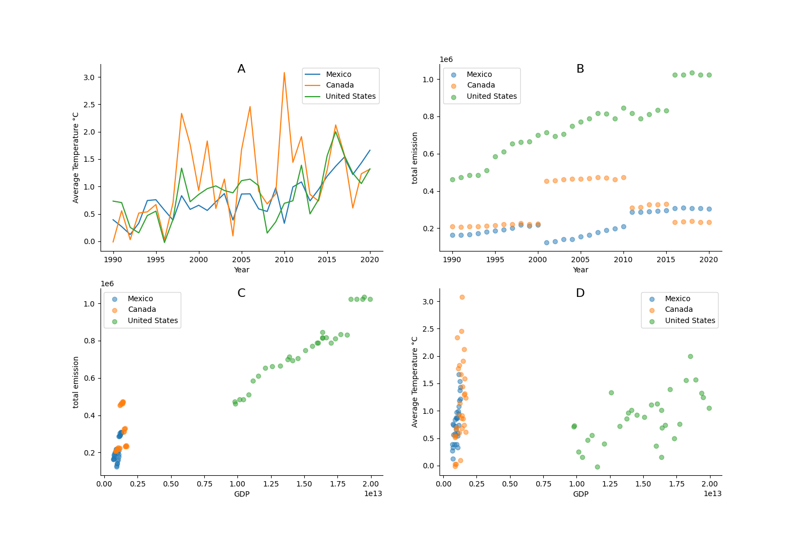

# UsingLibraries
Assigment 8 for Software Engineering Class

# Report

## Introduction
In this report the relationship between climate change and the changes in temperatures in North America has been studied. To do it, the dataset Agrofood_co2_emission and GDP were used. These files have information about the CO2 emission due to different sectors and Gross Domestic Product GDP through the years. 

To run the program, first the data needs to be processed running the script process_data.py, and then you can run the main.py script to get the plots.

## Results

The main results to be studied are shown in the [Figure 1](#fig1).

<!-- Figure 1: Mean Squared Error for each model -->

    
     
    <strong>Figure 1:</strong> Results for the analysis of Northamerica A: Year vs Average Temperature °C B: Year vs total emission C: GDP vs total emission D: GDP vs Average Temperature °C .

[Figure 1](#fig1) shows 4 plots that will be discussed. 

Figure 1.A shows the trend of average temperature from 1990 to around 2020 for Mexico, Canada, and the United States.

Canada shows greater fluctuations in temperature, especially in the earlier years, suggesting high variability in its climate. The United States and Mexico have more stable trends, though there is a general increase in temperature over the years, possibly indicating a warming trend consistent with global climate change.

This could point to varying climate patterns or differences in data collection. The observed temperature rise aligns with broader global warming trends.

Figure 1.B represents total emissions for the three countries over time.

The United States has the highest emissions consistently across the years, followed by Canada and Mexico. The data suggests a steady or slight increase in emissions for all countries, though the rate differs.

The emission trends reflect each country’s industrial activity and population. The United States’ higher emissions are likely due to its larger industrial base and higher population, whereas Mexico and Canada, with smaller economies, emit less.

Figure 1.C compares total emissions with GDP for each country.

There is a positive correlation between GDP and total emissions, especially notable for the United States, which shows a clear linear trend. Mexico and Canada have more dispersed data, with Mexico showing lower emissions even at similar GDP levels compared to Canada.

This indicates that higher economic output (GDP) is generally associated with higher emissions. The linearity in the U.S. trend may reflect a less energy-efficient economy compared to Canada and Mexico.

Figure 1.D examines the relationship between average temperature and GDP.

The United States’ data points show higher GDP but are spread across a range of temperatures. Canada shows a broader range of temperatures for a narrower GDP range. Mexico has relatively lower GDP values and temperatures. 

The spread in the U.S. data suggests that temperature change does not have a straightforward relationship with GDP. For Canada, the high temperature variability could be due to the country’s vast land area and northern latitude, affecting its climate sensitivity.

## Extra data

To make this report more convincing for uncle John, in the next year's Thanksgiving I would bring the data of the entire world through the years and not only North America, I would show the biggest climate events that affected the world economy in multiple ways and I would run some machine learning algorithms with the data to try to predict the worst scenarios that climate change could lead. 

# Conclusions

The plots suggest correlations between GDP and emissions, highlighting the environmental impact of economic growth. The rising temperature trend could be linked to increased emissions, hinting at climate change impacts.
